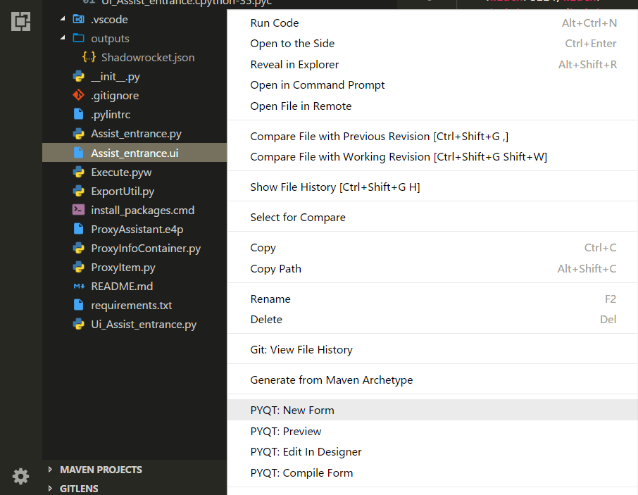

# PYQT Integration

[](https://marketplace.visualstudio.com/items?itemName=zhoufeng.pyqt-integration) [](https://marketplace.visualstudio.com/items?itemName=zhoufeng.pyqt-integration) [](https://marketplace.visualstudio.com/items?itemName=zhoufeng.pyqt-integration)

An extension help you coding PYQT form in vsocde. Support "`.ui`", "`.qrc`", "`.pro`", "`.ts`" files.



## Explorer context menu

|No.|Name|Description|
|:---:|---|---|
|1|PYQT: New Form|Open designer|
|2|PYQT: Edit In Designer|Open designer with current ui form|
|3|PYQT: Preview|Preview current ui form|
|4|PYQT: Compile Form|Compile ui form to path defined in "`pyqt-integration.pyuic.compile.filepath`"|
|5|PYQT: Compile Resource|Compile qrc file to path defined in "`pyqt-integration.pyrcc.compile.filepath`"|
|6|PYQT: Generate Translation File (.ts)|Compile UI file (.py) to translation file with path defined in "`pyqt-integration.pylupdate.compile.filepath`" <br/> Compile .pro file|
|7|PYQT: Open With Qt Linguist|Open with Qt Linguist for translation file (.ts)|

## Properties

|No.|Name|Description|
|:---:|---|---|
|1|`pyqt-integration.qtdesigner.path`|Path of executable file of qt designer, the extension will ask you to set at the first time it runs, e.g. c:\\\\Users\\\\username\\\\AppData\\\\Local\\\\Programs\\\\Python\\\\Python35\\\\Lib\\\\site-packages\\\\pyqt5-tools\\\\designer.exe|
|2|`pyqt-integration.pyuic.cmd`|"pyuic" command, default "`pyuic5`"|
|3|`pyqt-integration.pyuic.compile.filepath`|Compile file path, relative path as default, switch to absolute path by involving ${workspace}, e.g. \${workspace}\\\\UI\\\\Ui_\${ui_name}.py|
|4|`pyqt-integration.pyuic.compile.addOptions`|Additional options for pyuic compiling, it can be a combination of '-x', '-d', '-i', etc.|
|5|`pyqt-integration.pyrcc.cmd`|"pyrcc" command, default "`pyrcc5`"|
|6|`pyqt-integration.pyrcc.compile.filepath`|Compile file path, relative path as default, switch to absolute path by involving ${workspace}, e.g. \${workspace}\\\\QRC\\\\\${qrc_name}_rc.py|
|7|`pyqt-integration.pyrcc.compile.addOptions`|Additional options for pyrcc compiling, it can be a combination of '-root', '-threshold', '-compress', '-no-compress', etc.|
|8|`pyqt-integration.pylupdate.cmd`|"pylupdate" command, default "`pylupdate5`"|
|9|`pyqt-integration.pylupdate.compile.filepath`|Only works when compiling an UI file (.py), Stores the target '.ts' file's path, relative path as default, switch to absolute path by involving ${workspace}, e.g. ${workspace}\\\\TS\\\\\${ts_name}.ts|
|10|`pyqt-integration.pylupdate.compile.addOptions`|Additional options for pylupdate, it can be a combination of '-verbose', '-noobsolete', '-tr-function', '-translate-function', etc.|
|11|`pyqt-integration.linguist.cmd`|"linguist" command, default "`linguist`"|

```text
Compilation will overwite the target file without confirmation!
```